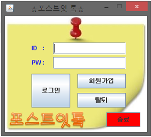
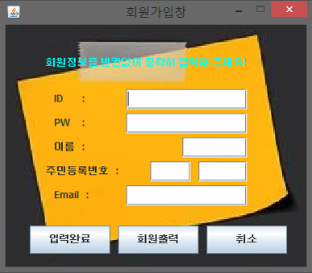
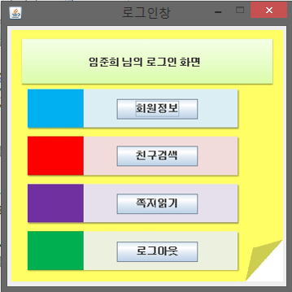
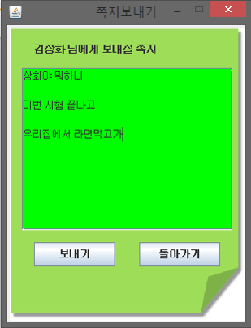
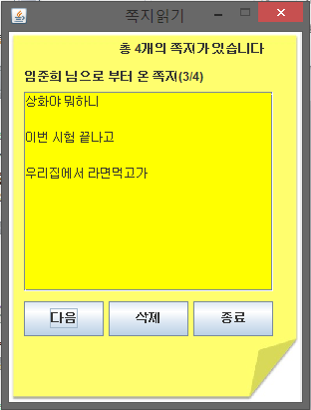

# Post_it-talk

### 수강과목 : 객체지향 프로그래밍(3학년 1학기)

### 프로젝트 개요 :  
포스트잇을 붙이고 띄는 기능에 아이디어를 **Java** 프로그래밍을 접목하여 메신져 애플리케이션 설계 및 구현.

### 기간 : 2013.03 ~ 2013.06

### 역할 : 총 4명 중 **팀장** 역할, 프로젝트 전체 설계와 회원 시스템, 친구 찾기, 쪽지 보내기, 파일 입출력 구현

### 주요 기능 :
- **회원제 시스템** 을 구현하여 개인정보 관리 및 보호와 데이터 저장
- **파일 입출력** 기능을 통해 회원제, 쪽지 쓰기, 읽기 기능 구현
- **Class와 상속, Vector** 를 사용하여 친구 찾기 기능과 쪽지 리스트 기능
- **Java Swing 패키지** 를 이용하여 **GUI** 구현

#### **사용 기술** : `Java`

#### **사용 툴** : `Eclipse IDE`

### SCREEN SHOT
-------

     